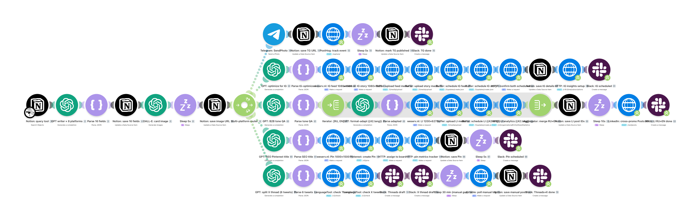
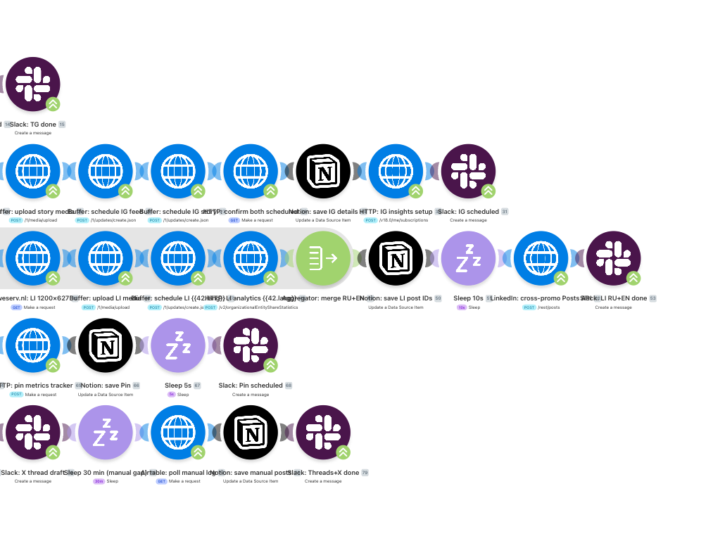

# 🤖 AI Content Factory

> End-to-end pipeline that turns a single Notion row into branded posts for **7 social channels** (Telegram, Instagram, LinkedIn RU + EN, Pinterest, Threads, X) — with auto-generated 1080×1350 cards using real brand logos.

[](.github/workflows/ci.yml)
[](pyproject.toml)
[](https://make.com)
[](https://developers.notion.com)
[](https://openai.com)
[](tests/)
[](LICENSE)

## 🎬 What it does

One GPT call per tool → 8 platform-specific text variants → DALL-E card + Pillow overlay with real brand logo → fan-out via Make.com to 7 publishing channels. The pipeline is scheduled (cron 4h) and was end-to-end tested on a private Telegram channel during development; 8 tool reviews were shipped through the live pipeline.

## 📸 Screenshots

<table>
  <tr>
    <td><br><b>60-module Make scenario</b><br><sub>Prep stage + router fan-out into 5 platform branches (asymmetric, 6 / 12 / 14 / 9 / 10 modules)</sub></td>
    <td><br><b>LinkedIn dual-language branch</b><br><sub>Iterator over [RU, EN] + Aggregator merging results</sub></td>
  </tr>
</table>

> For mocked architecture diagrams + card / Notion / Slack mockups, see `screenshots/mockups.html` (open in browser) or run `python screenshots/render.py`.

## ✨ Features

### Writer / multi-platform
- **Single GPT-4o-mini call → 8 platform versions in one JSON response** (8× cheaper than 8 separate calls)
- **7 platform renderers** (`app/platform_renderers.py`): Telegram HTML, Instagram (hashtags), Pinterest (title + desc), LinkedIn RU formal ("вы") + EN B2B ("you"), Threads ≤500c, X 6-tweet thread
- **Heuristic ты→вы converter** for LinkedIn RU
- **Niche rotation analyzer** (`app/niche_history.py`) — reads published rows from Notion, counts niche frequency, feeds a "use less-saturated niches" hint into the writer prompt
- **Per-platform char limits** enforced at render time (1024 / 2200 / 100+500 / 3000 / 500 / 280×6)

### Visual generation
- **`app/card_generator.py`** — Pillow-based renderer producing 1080×1350 cards
- **Real brand logos** fetched from 3 sources (App Store icons → gilbarbara/logos SVG via cairosvg → favicon fallback)
- **Auto-trim transparent padding** for consistent visual mass across icons
- **Avenir Next typography** with Cyrillic fallback (Arial Unicode)
- **Drop-shadow stat cards** with vertically centered value+label blocks

### Make.com orchestration
- **5 production scenarios** built programmatically from Python (`make_blueprints/*.py`):
  - `03_writer` — GPT × 8 platforms per row, cron 4h
  - `06_publisher_telegram` — Notion query → image download → SendPhoto → mark published, cron 4h
  - `07_stacks_publisher` — tool-stack publisher, cron 3 days
  - `08_publisher_multi` — Buffer batch to IG / LinkedIn / Pinterest
  - `00_factory_overview` — 60-module showcase (Notion → writer → DALL-E → router → 5 platform branches with Iterator/Aggregator)
- **Funnel filters on connection edges** (real Make pattern, not "filter modules")
- **Asymmetric branches** (6 / 12 / 14 / 9 / 10 modules) reflecting real platform complexity
- **Iterator + Aggregator pattern** for LinkedIn dual-language posting

### Operations
- **All secrets via env vars** (`app/config.py`) — never hardcoded
- **One-time setup scripts** in `scripts/` (Notion DB creation + seeding + weekly backup)
- **Slack notifications** at each stage for transparency
- **Cost log per run** — average $0.0044 per tool (5 platform versions)
- **18 smoke tests passing** covering renderers, card generator, blueprint builders, config

## 🧱 Stack

| Layer | Tool |
|---|---|
| Orchestration | Make.com (scenarios POSTed via REST API) |
| Content database | Notion (REST API) |
| Text generation | OpenAI GPT-4o-mini |
| Image generation | OpenAI DALL-E 3 + Pillow card renderer |
| Multi-platform fan-out | Buffer API (IG / LinkedIn / Pinterest) + native Telegram, X, Slack |
| Logo resolution | App Store iTunes search → gilbarbara/logos SVG → favicon (3-tier fallback) |
| SVG rasterisation | cairosvg (optional, for crispest SVG → PNG) |
| Tests / lint | pytest + ruff |
| Containerisation | Docker + docker-compose |

## 🏗 Architecture

```
                  Notion (Tools_Catalog DB)
                          │
                          ▼
  ┌─────────────────────────────────────────────────────────┐
  │ Make.com scenario 03_writer (cron 4h)                   │
  │   Notion query → GPT-4o-mini → Parse → PATCH 16 fields  │
  │                                                         │
  │ Make.com scenario 04 (chained)                          │
  │   DALL-E 3 → app/card_generator (PIL) → CDN upload      │
  └─────────────────────────────────────────────────────────┘
                          │
                          ▼
                  Notion (Stage=ready_for_review)
                          │
                          ▼
  ┌─────────────────────────────────────────────────────────┐
  │ Make.com 06_publisher_telegram (cron 4h)                │
  │   → Telegram channel                                    │
  │                                                         │
  │ Make.com 08_publisher_multi (or local Python)           │
  │   → Buffer → Instagram / LinkedIn RU + EN / Pinterest   │
  │   → Slack #manual-publish (Threads / X drafts)          │
  └─────────────────────────────────────────────────────────┘
                          │
                          ▼
                  Notion (Stage=published, Published To=[...])
```

## 🚀 Quickstart

```bash
# 1. Clone + install deps
git clone <repo> ai-content-factory
cd ai-content-factory
python -m venv .venv && source .venv/bin/activate
pip install -r requirements-dev.txt

# 2. Copy env template + fill in your keys
cp .env.example .env
$EDITOR .env

# 3. Create your Notion databases (one-time)
export NOTION_PARENT_PAGE_ID=<your_parent_page>
python -m scripts.create_notion_dbs
python -m scripts.seed_notion_dbs

# 4. Deploy Make.com scenarios (each script POSTs a new scenario)
python -m make_blueprints.03_writer
python -m make_blueprints.06_publisher_telegram
python -m make_blueprints.07_stacks_publisher
python -m make_blueprints.08_publisher_multi
python -m make_blueprints.00_factory_overview   # showcase / overview scenario

# 5. (Optional) Run niche rotation analyzer
python -m app.niche_history
```

Update an existing scenario (PATCH instead of POST):

```bash
SCENARIO_ID=4993619 python -m make_blueprints.03_writer
```

## 🔑 Environment variables

| Var | Required | Purpose |
|---|---|---|
| `NOTION_TOKEN` | yes | Notion integration secret |
| `OPENAI_API_KEY` | yes | OpenAI API key (used by Make scenario via `MAKE_OPENAI_CONN`) |
| `MAKE_TOKEN` | yes | Make.com API token (Token-auth) |
| `TELEGRAM_BOT_TOKEN` | yes | Telegram bot used by the publisher |
| `MAKE_ZONE` | no | Make zone (default `us2`) |
| `MAKE_TEAM_ID` | yes | Make team numeric ID |
| `MAKE_NOTION_CONN` / `MAKE_OPENAI_CONN` / `MAKE_TELEGRAM_CONN` / `MAKE_SLACK_CONN` | yes | Make per-workspace connection IDs |
| `NOTION_TOOLS_DB` / `NOTION_STACKS_DB` | yes | Notion DB IDs (set after `scripts/create_notion_dbs.py`) |
| `NOTION_PARENT_PAGE_ID` | once | Used only by `create_notion_dbs.py` |
| `TELEGRAM_CHANNEL` | yes | Target channel: `-100xxxxxxxxxx` (numeric) or `@handle` |
| `TELEGRAM_CHANNEL_USERNAME` | no | Display @handle for card footer |
| `BUFFER_TOKEN` | for multi-platform | Buffer API access token |
| `BUFFER_IG_PROFILE` / `BUFFER_LINKEDIN_RU_PROFILE` / `BUFFER_LINKEDIN_EN_PROFILE` / `BUFFER_PINTEREST_PROFILE` | for multi-platform | Per-platform Buffer profile IDs |
| `SLACK_BOT_TOKEN` | for notifications | Slack bot token (used for #content-factory pings) |
| `BRAND_NAME` / `BRAND_TAGLINE` | recommended | Shown in card footer + hashtag generation |
| `MAKE_SCENARIO_IDS` | for backups | Comma-separated scenario IDs for `scripts/backup_blueprints.py` |

See `.env.example` for full annotations.

## 🧪 Tests

```bash
pytest -v
```

18 tests covering:
- `tests/test_config.py` — env var loading & validation
- `tests/test_platform_renderers.py` — 7-platform char limits, HTML, hashtags, Telegram-HTML parser round-trip
- `tests/test_card_generator.py` — helpers, font fallback, logo trim
- `tests/test_blueprints.py` — every Make blueprint builder produces valid JSON

```
============================== 18 passed in 0.30s ==============================
```

## 🐳 Docker

```bash
docker compose build
docker compose run --rm factory                              # niche history (smoke)
docker compose --profile manual run --rm writer              # run writer scenario builder
docker compose --profile manual run --rm publisher-telegram  # run TG publisher builder
```

## 📦 Project layout

```
3_ai_content_factory/
├── app/                              # Core libraries (no Make.com dependency)
│   ├── config.py                       # Centralised env var loader
│   ├── card_generator.py               # 1080×1350 card renderer (Pillow)
│   ├── platform_renderers.py           # 7-platform text rendering + Post dataclass
│   └── niche_history.py                # Niche frequency analyzer
├── make_blueprints/                  # Make.com scenario builders (one .py per scenario)
│   ├── _builder.py                     # Shared helpers (HTTP modules, post_scenario, patch_scenario)
│   ├── 00_factory_overview.py          # 60-module showcase
│   ├── 03_writer.py                    # GPT writer × 8 platforms
│   ├── 06_publisher_telegram.py        # Telegram publisher
│   ├── 07_stacks_publisher.py          # Tool-stack publisher
│   ├── 08_publisher_multi.py           # Buffer multi-platform
│   └── exports/                        # Generated blueprint JSON (gitignored)
├── scripts/                          # One-time setup utilities
│   ├── create_notion_dbs.py            # Bootstrap Notion DB schema
│   ├── seed_notion_dbs.py              # Insert seed sources / brand voice examples
│   └── backup_blueprints.py            # Weekly snapshot of all Make scenarios
├── tests/                            # Smoke tests (pytest)
├── screenshots/                      # Mockups + render.py + sample real screenshots
├── seeds/                            # Public seed data (sources_seed.csv)
├── data/                             # Runtime state, gitignored
├── .env.example
├── .gitignore
├── .github/workflows/ci.yml
├── Dockerfile
├── docker-compose.yml
├── pyproject.toml
├── requirements.txt
├── requirements-dev.txt
├── LICENSE
├── CHANGELOG.md
└── README.md
```

## 📄 License

MIT — see [LICENSE](LICENSE).
